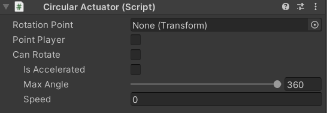
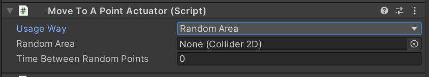
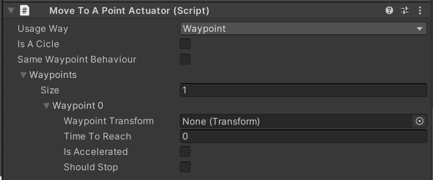
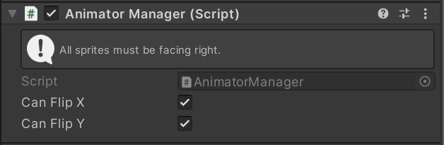
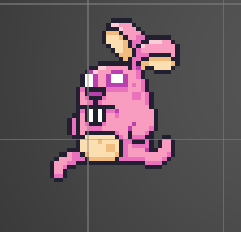
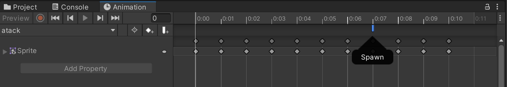
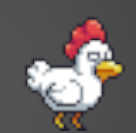

# ***Manual de Uso para Framework de comportamientos de enemigos para videojuegos 2D***

[🇬🇧 Read in English](../readme.md)  
***Bienvenido al manual de uso.***  
**Creadores:** Cristina Mora Velasco y Francisco Miguel Galván Muñoz  
**Fecha:** Marzo de 2025

## Índice

- [Introducción](#introducción)
- [Objetivo de la herramienta](#objetivo-de-la-herramienta)
- [Objetivo del manual](#objetivo-del-manual)
- [Funcionalidad](#funcionalidad)
- [Público Objetivo](#público-objetivo)
- [Requisitos](#requisitos)
- [Instalación](#instalación)
- [Contenido del Paquete](#contenido-del-paquete)
- [Componentes Detallados](#componentes-del-framework)
  - [Máquina de Estados Finita (FSM)](#máquina-de-estados-finita-fsm)
  - [Estado (State)](#estado)
  - [Sensores](#sensores)
  - [Actuadores](#actuadores)
  - [Animator Manager](#animator-manager)
- [Ejemplos Prácticos](#ejemplos-de-uso)
- [Solución de Problemas](#solución-de-problemas)
- [Preguntas Frecuentes](#preguntas-frecuentes)
- [Glosario](#glosario)
- [Contacto y Soporte](#contacto-y-soporte)

## Introducción

Este documento proporciona *instrucciones detalladas sobre cómo utilizar la herramienta de comportamiento de enemigos para videojuegos 2D*.  
Este manual se divide en varias secciones que cubren todos los aspectos necesarios para la instalación y el uso de la herramienta. Inicialmente, se guiará al usuario a través del proceso de instalación desde un repositorio de GitHub. A continuación, se detallará la [arquitectura](#arquitectura) de la herramienta, explicando los componentes clave y el concepto de las [Máquinas de Estados Finitas](#fsm). Posteriormente, se presentará un [flujo de trabajo](#flujo-de-trabajo) paso a paso para la creación de nuevos enemigos, incluyendo la configuración de [estados](#estado), transiciones, sensores y actuadores. Finalmente, se ofrecerán consejos y mejores prácticas para el diseño de enemigos efectivos, así como información sobre cómo obtener soporte técnico.

## Objetivo de la herramienta

Con el paso del tiempo, los juegos han evolucionado haciéndose cada vez más complejos. Los enemigos que, son el principal obstáculo del jugador, tienen que seguir siendo lo suficientemente desafiantes para captar la atención del jugador pero no sentirse abrumado. Esto incrementa el tiempo y complejidad de creación. Para facilitar esta tarea, **Enemy Behaviour Framework 2D** tiene como objetivo la creación de enemigos completamente funcionales partiendo de elementos sencillos llamados actuadores y controlados por una máquina de estados. Además, para poder tener información del exterior se necesitarán sensores, que funcionarán como transición entre los diferentes estados.

## Objetivo del manual

Este manual tiene como objetivo proporcionar una guía clara y detallada para que los usuarios puedan instalar, configurar y utilizar la herramienta con mayor facilidad.  

*La herramienta ha sido diseñada para simplificar y mejorar el proceso de creación de enemigos 2D funcionales dentro del entorno de Unity*.  

Utilizando una arquitectura basada en Máquinas de Estado Finitas (FSM), permite a los diseñadores definir el comportamiento de los enemigos de manera visual e intuitiva, a través de la adición de estados y transiciones personalizadas.

## Funcionalidad

- Creación y gestión de comportamientos de enemigos en 2D.
- Implementación de máquinas de estados para definir la IA de los enemigos.

## Público objetivo

Tanto la herramienta como el manual han sido creados para *diseñadores o personas sin conocimientos avanzados en programación*.  
Si bien *se recomienda tener un conocimiento básico de Unity* y de los conceptos fundamentales del desarrollo de juegos, este manual se ha elaborado con la intención de ser lo suficientemente completo como para que usuarios con distintos niveles de experiencia puedan utilizar la herramienta de manera efectiva.

## Requisitos

Antes de comenzar, asegúrate de cumplir con los siguientes requisitos:

- Disponer de una versión igual o superior a *2022.3.18 (LTS)* de Unity.

## Instalación

1. Descarga de la Herramienta desde GitHub:
   - La herramienta se distribuye como un paquete de Unity a través de una URL de GitHub. Para obtener la herramienta, accede al [link](https://github.com/CiscoGalvan/TFG/blob/main/Package/FrameworkEnemies2D.unitypackage).
   - Una vez en el repositorio, presiona las teclas *Control + Shift + S* o haz clic en *More File Actions* (botón de los tres puntos) y selecciona *Descargar*.
2. Abre Unity y carga tu proyecto o crea un nuevo proyecto 2D.
3. En Unity, ve a *Assets > Import Package > Custom Package*.
4. Selecciona el archivo descargado (*.unitypackage*).
5. Presiona *Importar* y asegúrate de marcar todas las opciones necesarias.
6. Una vez importado, verifica que los archivos de la herramienta aparecen en la ventana *Project* de Unity.

## Contenido del Paquete

### Scripts

- Contiene los [scripts](#script) necesarios para el funcionamiento del [framework](#framework).
- Incluye lógica de gestión de estados, comportamientos de enemigos y detección de colisiones.
- Organizados en subcarpetas según su funcionalidad (*FSM*, *Actuators*, *SensorsAndEmitters*, *Editors*, *PlayerBehaviour*, *Basic Components*, *Editors*, *Animation*).

### Scenes

- Contiene escenas de ejemplo con enemigos funcionales.
- Cada escena muestra configuraciones distintas.

### Prefabs

- Incluye [prefabs](#prefab) de enemigos preconfigurados listos para su uso.

### Animations

- Contiene clips de animación de enemigos.
- Incluye animaciones como *Idle*, *Walk*, *Attack* y *Death*.
- Controller de ejemplo para controlar las animaciones.
- Compatible con el sistema de *Animator* de Unity.

## Componentes del Framework

Todos los componentes del Framework serán encontrados en la carpeta *Scripts*.
Se tomará esta carpeta como referencia para indicar donde se encuentran los componentes que serán nombrados a continuación.

### Actuadores

Los actuadores son componentes que permiten a los enemigos realizar acciones. Estas acciones son las que definen el movimiento o creación de otros enemigos.
Encontraremos todos los actuadores en la carpeta llamada *Actuators*.
Disponemos de 7 tipos de actuadores:

- **Spawner Actuator**:

    
  Permite generar (spawnear) nuevos enemigos. Se encuentra en *Actuators/Spawner.*

  - *Infinite Enemies:* Si se quiere crear infinitos enemigos, en caso contrario se debe especificar la cantidad de veces que vamos a spawnear la lista.
  - *Spawn Interval:* Cada cuánto tiempo se crean.
  - *Prefab to Spawn:* Objeto que queremos crear.
  - *Spawn Point:* Posición donde queremos que se cree el objeto.

  Al ser una lista, podemos spawnear más de un objeto a la vez.

Los siguientes actuadores se encontrarán en la carpeta *Actuators/Movement.*
- **Horizontal Actuator**:  

    
Este actuador permite mover un objeto horizontalmente, ya sea a la izquierda o a la derecha, con diferentes configuraciones de velocidad y comportamiento tras una colisión. Tiene distintas configuraciones.

  - *Reaction After Collision*  
  Define qué sucede cuando el objeto choca contra otro:
    - *None:* No hay ninguna reacción al colisionar.
    - *Bounce:* El objeto cambia de dirección y sigue moviéndose en sentido contrario.
    - *Destroy:* El objeto desaparece al colisionar.
  - *Layers To Collide*
  En caso de que *Reaction After Collision* no sea *None* aparecerá este campo que determinará con que capa física puede ocurrir la acción designada.
  - *Follow Player*
   En caso de ser marcado, el objeto se moverá horizontalmente en dirección al jugador. Esta opción inhabilita la posibilidad de elegir una dirección.
  - *Direction*  
  Determina hacia dónde se mueve el objeto:
    - *Left:* El objeto se moverá hacia la izquierda.
    - *Right:* El objeto se moverá hacia la derecha.
  - *Is Accelerated*  
    - *False:* Si no es acelerado, el enemigo se moverá con una velocidad lineal constante. Se podrá configurar:  
      - *Throw:* Se aplicará una única vez la fuerza, simulando un lanzamiento.
      - *Speed:* Establece la velocidad a la que se moverá el objeto.
    - *True:* Si el movimiento si es acelerado, la velocidad irá aumentando:
      - *Goal Speed:* Es la velocidad máxima que alcanzará el objeto después de acelerar.
      - *Interpolation Time:* Es el tiempo que tarda el objeto en pasar de velocidad actual a su velocidad objetivo.
      - *Easing Function:* Define cómo se comporta la aceleración.

- **Vertical Actuator**:  
   
  Este actuador permite mover un objeto vertical, ya sea hacia arriba o hacia abajo, con diferentes configuraciones de velocidad y comportamiento tras una colisión.

  - *Reaction After Collision*  
  Define qué sucede cuando el objeto choca contra otro:
    - *None:* No hay ninguna reacción al colisionar.
    - *Bounce:* El objeto cambia de dirección y sigue moviéndose en sentido contrario.
    - *Destroy:* El objeto desaparece al colisionar.
  - *Layers To Collide*
  En caso de que *Reaction After Collision* no sea *None* aparecerá este campo que determinará con que capa física puede ocurrir la acción designada.
   - *Follow Player*
    En caso de ser marcado, el objeto se moverá verticalmente en dirección al jugador. Esta opción inhabilita la posibilidad de elegir una dirección.
  - *Direction*  
  Determina hacia dónde se mueve el objeto:
    - *Up:* El objeto se moverá hacia arriba.
    - *Down:* El objeto se moverá hacia abajo.
  - *Is Accelerated*  
    - *False:* Si no es acelerado, el enemigo se moverá con una velocidad lineal constante. Se podrá configurar:  
      - *Throw:* Se aplicará una única vez la fuerza, simulando un lanzamiento.
      - *Speed:* Establece la velocidad a la que se moverá el objeto.
    - *True:* Si el movimiento es acelerado, la velocidad irá aumentando:
      - *Goal Speed:* Es la velocidad máxima que alcanzará el objeto después de acelerar.
      - *Interpolation Time:* Es el tiempo que tarda el objeto en pasar de velocidad actual a su velocidad objetivo.
      - *Easing Function:* Define cómo se comporta la aceleración.

- **Directional Actuator**:  
  
  Hace que el enemigo se mueva en una dirección específica descrita por un ángulo.
  - *Reaction After Collision*  
  Define qué sucede cuando el objeto choca contra otro:
    - *None:* No hay ninguna reacción al colisionar.
    - *Bounce:* El objeto cambia de dirección y simula un rebote.
    - *Destroy:* El objeto desaparece al colisionar.
  - *Layers To Collide*
  En caso de que *Reaction After Collision* no sea *None* aparecerá este campo que determinará con que capa física puede ocurrir la acción designada.
  - *Is Accelerated*  
    - *False:* Si no es acelerado, el enemigo se moverá con una velocidad lineal constante. Se podrá configurar:  
      - *Throw:* Se aplicará una única vez la fuerza, simulando un lanzamiento.
      - *Speed:* Establece la velocidad a la que se moverá el objeto.

    - *True:* Si el movimiento si es acelerado, la velocidad irá aumentando:
      - *Goal Speed:* Es la velocidad máxima que alcanzará el objeto después de acelerar.
      - *Interpolation Time:* Es el tiempo que tarda el objeto en pasar de velocidad actual a su velocidad objetivo.
      - *Easing Function:* Define cómo se comporta la aceleración.
  - *Aim Player:* Indica si el objeto va a seguir la dirección del jugador (con esta opción el ángulo no aparece porque se le da valor en función de tu posición y la del objetivo). 
  - *Angle:*  Ángulo con el que va a moverse el objeto.
   Para ello tiene que existir un objeto con la [tag](#tag) "Player".
  

- **Circular Actuator**:  
  
 Permite movimientos circulares en torno a un punto de rotación determinado.
  - *Rotation Point*  
    Define el punto central sobre el cual se realiza la rotación.  
    - *None:* Si no se asigna, el objeto girará en torno a su propio centro.  
    - *[Transform](#transform):* Si se asigna un objeto, la rotación se realizará alrededor de ese punto.  
  - *Point Player*
   El objeto rotará teniendo en cuenta la posición del jugador.
  - *Can Rotate*  
    Determina si el objeto puede rotar sobre su propio eje además de moverse en círculo.  

  - *Max Angle*  
    Ángulo máximo que puede alcanzar el movimiento circular (360 indica un círculo completo, el resto de ángulos se comporta como un péndulo).  
    - *False:* El objeto solo se moverá en la trayectoria circular sin girar sobre sí mismo.  
    - *True:* El objeto girará sobre su propio eje mientras se mueve.  

  - *Is Accelerated*
    - *False:* Si no es acelerado, el objeto se moverá con velocidad constante definida por el parámetro *Speed*.  
    - *True:* Si es acelerado, la velocidad aumentará progresivamente según los siguientes parámetros:  
      - *Goal Speed:* Es la velocidad máxima que alcanzará el objeto.  
      - *Interpolation Time:* Es el tiempo que tarda el objeto en pasar de velocidad angular actual a su velocidad angular objetivo.  
      - *Easing Function:* Define cómo se comporta la aceleración.

- **Move To A Point Actuator**:  
Hace que el enemigo se mueva hacia un punto fijo específico del escenario. Hay dos configuraciones dependiendo del *Mode*.
  - *Random Area*: Coge puntos aleatorios dentro de un área.

    - *Random Area*
     [Collider](#collider) que servirá para la referencia del área.
    - *Time Between Random Points:* Cada cuánto cambia el punto a otro distinto.
  - *Waypoint*
   Indica que queremos seguir un camino predeterminado de puntos.
    - *Loop*
     Indica si queremos que al llegar al final de los waypoints, se vuelva a iniciar la lista.
    - *Same Waypoint Behaviour*
     Indica si queremos que el comportamiento sea el mismo para todos los waypoints.
      - Si es así, se creará un panel único de especificación de puntos:  
  
        - *Time Between Waypoints*
         Tiempo que se tarda entre un punto y otro.
        - *Are Accelerated*
         Si el movimiento es acelerado o no. En caso de serlo, aparecerá una easing function que indicará con qué aceleración se mueve.
        - *Should Stop*
         Indica si debe o no parar al llegar a un punto. Si se debe parar, hay que  indicar cuánto tiempo.  
      - Si no es así, aparecerán los mismos datos por cada waypoint:  
      

- **Move To An Object Actuator**:  
  
  Hace que el enemigo se desplace automáticamente hacia un objeto determinado, si el objeto se mueve, el enemigo cambiará su dirección para ir hacia el objeto.
  - *Object Transform*
   Transform del objeto al que se quiere perseguir.
  - *Time To Reach*
   Tiempo que tarda en llegar al objetivo.
  - *Is Accelerated*
    - *False*
     Si no es acelerado, la posición cambiará de manera constante.  
    - *True*
     Si es acelerado, la posición se definirá mediante la función de easing:
      
- **Spline Follower Actuator**:  
  
  Hace que el enemigo se desplace y rote automáticamente siguiendo una ruta definida por un spline.
  - *Spline Container*
   Transform del objeto al que se quiere perseguir.
  - *Teleport To Closest Point*
   Indica si, en caso de que la posición del enemigo no coincidiese con el Spline, que objeto cambia su posición.
  - *Speed*
   Tiempo que tarda en llegar al objetivo.
  - *Is Accelerated*
    - *False*
     Si no es acelerado, el objeto se moverá con velocidad constante definida por el parámetro *Speed*.  
    - *True*
     Si es acelerado, la velocidad aumentará progresivamente según los siguientes parámetros:  
      - *Goal Speed*
       Es la velocidad máxima que alcanzará el objeto.  
      - *Interpolation Time*
       Es el tiempo que tarda el objeto en pasar de velocidad actual a su velocidad objetivo.  
      - *Easing Function*
       Define cómo se comporta la aceleración.

### Sensores

Los sensores permiten detectar información del entorno y activar transiciones.
 Disponemos de cinco sensores y podemos encontrarlos en *SensorsAndEmitters/TypeOfSensors*:

- **Area Sensor:**  
    
  El sensor de área detecta cuando un objeto específico entra dentro de su zona de detección. 
  - *Start Detecting Time*
   Tiempo de delay hasta que empiece la detección.
  - *Target*
   Objeto que se quiere detectar.
  - *Detection Condition*
   Indica si quiere detectar al salir o al entrar del área.

- **Collision Sensor:**  
    
  Detecta cuando el enemigo choca físicamente con otro objeto. A diferencia del *Area Sensor*, este requiere una colisión real en lugar de solo detectar la presencia dentro de un área. 
  Se debe especificar qué *[capas físicas](#capa-fisica)* activan el sensor.
  - *Start Detecting Time*
   Tiempo de delay hasta que empiece la detección.
  - *Layers to Collide*
   Máscara de capas físicas donde se debe indicar con que queremos chocar.

- **Distance Sensor:**  
  
  Detecta cuando un objeto específico *Target* está a una *determinada distancia del enemigo*. 
  - *Distance type*
   Tipo de distancia que se quiere comprobar.
    - Magnitud: 360 grados de detección.
    - Single Axis: Un único eje.
  - *Detection Condition*
   Indica si quiere dectectar al salir o al entrar del área.
  - *Target*
   Objeto que se quiere detectar.
  - *Start Detecting Time*
   Tiempo de delay hasta que empiece la detección.
  - *Detection Distance*
   Distancia de detección.
  
- **Time Sensor:**
  
 Detecta cuando pasa un tiempo específico.
  - *Start Detecting Time*
   Tiempo de delay hasta que empiece la detección.
  - *Detection Time*
   Tiempo de detección.

### Daño

Para poder realizar daño se necesita un sensor y un emisor.
- **Damage Sensor:**  
  
  Detecta cuando una entidad *recibe daño*.
  Este sensor es utilizado a la hora de gestionar la *vida* tanto de los enemigos como del propio jugador.  Para que se pueda recibir daño se debe tener *Active From Start* a true.

- **Damage Emitter**:  
  Es el encargado de *hacer daño*, en él tienes que especificar el tipo de daño, cada tipo de daño tiene sus propios parámetros:

  - **Instant:**  
    
  Daño instantáneo que afecta una única vez al entrar en contacto.  
    - *Destroy After Doing Damage*
     Indica si queremos que el objeto desaparezca tras hacer daño.  
    - *Instant Kill*
     Indica si queremos que elimine directamente a la entidad con la que colisiona.  
    - *Damage Amount*
     En caso de no querer eliminar directamente a la entidad colisionada, se indica el daño que queremos aplicar.

  - **Permanence:**  
    
  El daño por permanencia afecta mientras estés dentro del objeto.  
    - *Damage Amount*
     Cantidad de vida que se resta cada vez.  
    - *Damage Cooldown*
     Intervalo de tiempo entre cada aplicación de daño.

  - **Residual:**  
    
  El daño residual sigue afectando incluso cuando ya no estás en contacto.  
    - *Destroy After Doing Damage*
     Permite indicar si el objeto debe eliminarse después del primer golpe.  
    - *Instant Damage Amount*
     Daño inicial que se aplica al primer contacto.  
    - *Residual Damage Amount*
     Daño aplicado en cada repetición residual.  
    - *Damage Cooldown*
     Intervalo de tiempo entre cada aplicación de daño residual.  
    - *Number Of Applications*
     Número total de veces que se aplica el daño residual.

### Estado

Un estado es un comportamiento concreto que puede tener un enemigo en un cierto tiempo. Los estados se encargan de almacenar las acciones.  
    
  Hace que el enemigo se desplace  y rote automáticamente siguiendo una ruta definida por un spline.

- *Actuator List*
 Acción/acciones vamos a realizar.
- *Transition List*
  Para poder tener *Transiciones* de un estado a otro, se debe especificar el sensor que estará encargado de detectar ese cambio y el estado al que se desea pasar.
- *Damage Emitters List*
 En caso de que queramos que en el estado se realice daño, se deberá especificar qué *DamageEmitter* se encontrará activo.  
- *Debug State*
 Si deseamos *depurar* información sobre el movimiento que se va a realizar.

### Máquina de Estados Finita (FSM)

    
  La FSM organiza el comportamiento de un enemigo en **estados** (Idle, Patrol, Attack, etc.). Esta es la encargada de llamar y gestionar todos los estados de un enemigo.  

- *Initial State*
 Estado inicial del enemigo.

**Ejemplo:** Un "Guardia" puede tener estados como Patrol, Chase y Attack. Si el jugador entra en su campo de visión, transiciona de Patrol a Chase. Si lo alcanza, a Attack. Si lo pierde de vista, vuelve a Patrol.

### Animator Manager

   
Se encarga de gestionar las animaciones de los enemigos en función de sus estados y acciones.
Es importante que todos los [sprites](#sprite) que se quieran utilizar *se orienten hacia la derecha*.

- *Can [Flip](#flip) X*
 Indica si el sprite se puede rotar en el eje X.
- *Can Flip Y*
 Indica si el sprite se puede rotar en el eje Y.

### Life

Gestiona la vida de los objetos.  
   

- *Entity Type*
 Tipo de entidad (Player o Enemy).
- *Initial Life*
 Vida inicial.
 - *Max Life*
 Vida máxima.

## Ejemplos de Uso

Todos los ejemplos parten de la Scene Template: **Base Scene**.  
Para crear una nueva escena desplegar el menú de File, New Scene, seleccionar Base Scene y selecciona Create.
La escena cuenta con un jugador y un mundo listos para funcionar.

**AVISO**: En los ejemplos, cuando se dice borrar todos los estados del Animator, se refiere a los que no son propios de Unity, es decir, los que aparecen en color Gris. Los estados propios de Unity seguirán apareciendo aunque se intenten borrar.  

**Aviso sobre el Arte:** El material gráfico utilizado principalmente en este framework ha sido obtenido del Asset Store de Unity y pertenece al creador Pixel Frog, cuya página de itch.io es: [https://pixelfrog-assets.itch.io/](https://pixelfrog-assets.itch.io/)  
El águila y efectos de items son de:
<https://assetstore.unity.com/packages/2d/characters/sunny-land-103349>

### Primer Ejemplo: Spikes

Uno de los enemigos más comunes son los pinchos, que no se mueven pero sí que dañan al jugador. Vamos a crearlos.
Para el ejemplo usaremos la imagen de los pinchos:  

 1. Crea un objeto llamado pinchos partiendo del prefab BaseEnemy que se encuentra en Assets/Prefabs.
 2. Cambia el Sprite del *[Sprite Renderer](#sprite-renderer)* a la imagen de pinchos (si no coincidiese ya) que se encuenta en Assets/Animations/Sprites/Spikes y ajusta el Collider a la imagen.
 3. Congela la posición del enemigo en X y en Y seleccionando la opción del componente Rigidbody2D → Constraints → Freeze Position → X/Y, para que los pinchos se mantengan fijos.
 4. Congela la rotación del Rigidbody2D en la opción Rigidbody2D → Constraints → Freeze Rotation → Z. 
 5. Elimina el AnimatorManager y Animator, en este caso no son necesarios porque el objeto no tiene animación.
 6. Configuramos el Damage Emitter:  
     - Active From Start: True
     - Damage Type: Permanence
     - Damage Amount: 1
     - Damage Cooldown: 2

### Segundo Ejemplo: Bouncing Bunny

Otro enemigo muy común son deambuladores, también conocidos como: Goomba, Reptacillo, o con otro nombre en muchos juegos.
Para el ejemplo usaremos la imagen del conejo:  

 1. Crea un objeto llamado deambulador partiendo del prefab BaseEnemy que se encuentra en Assets/Prefabs.
 2. Cambia el Sprite del *Sprite Renderer* a cualquier imagen de Bunny que se encuentra en Assets/Animations/Sprites/Bunny y ajusta el Collider a la imagen.
 3. Congela la rotación del Rigidbody2D en la opción Rigidbody2D → Constraints → Freeze Rotation → Z.
 4. Configuramos el Damage Emitter:  
     - Active From Start: True
     - Damage Type: Instant
     - Destroy After Doing Damage: False
     - Instant Kill: False
     - Damage Amount: 1
 5. Añadimos un componente de movimiento Horizontal Actuator al objeto y lo arrastramos hasta el Actuator List del State.
 6. Configuramos el Horizontal Actuator:
    - Reaction After Collision: Bounce
    - Layers to Collide: World, Player
    - Follow Player: False
    - Direction: Left
    - Is Accelerated: False
    - Throw: False
    - Speed: 7  
 7. Configuramos el Animator Manager:
      - Can Flip X: True
      - Can Flip Y: False

 8. Duplicamos el *Animator Controller* que viene creado como ejemplo en Assets/Animations.
 9. Entramos en el editor de animaciones de Unity (haciendo doble click sobre el *Animator Controller* que acabamos de crear), donde veremos muchos estados posibles, como solo queremos que haga las animaciones: Movimiento Horizontal, Damage y Die, borraremos el resto de estados (seleccionamos con el ratón y pulsamos suprimir).
 10. Hacemos click sobre el estado Horizontal Movement y arrastramos la animación que queremos hacer hasta *Motion*, en este caso vamos a usar *Run* que se encuentra en Assets/Animations/Sprites/Bunny.
 11. Hacemos click sobre el estado Damage y arrastramos la animación que queremos hacer hasta Motion, en este caso vamos a usar Hit que se encuentra en Assets/Animations/Sprites/Bunny.
 12. Hacemos click sobre el estado Die y arrastramos la animación que queremos hacer hasta Motion, en este caso vamos a usar Hit que se encuentra en Assets/Animations/Sprites/Bunny.
 13. Añadimos el controlador que hemos duplicado al Animator del enemigo deambulador.
 14. Por último añadimos el componente *Life* lo que también nos añadirá un *DamageSensor*.
 15. Los parámetros del componente *Life* quedarían de la siguiente manera:
     - Initial Life: 1
     - Max Life: 1
 16. En *DamageSensor* vamos a marcar la casilla de Active From Start.

### Tercer Ejemplo: Trunk Torret
Vamos a continuar creando un enemigo que dispare balas, para ello vamos a crear primero las balas y luego el enemigo.  
Para el ejemplo usaremos la imagen de la bala:  

 1. Crea un prefab llamado Bullet partiendo del prefab BaseEnemy que se encuentra en Assets/Prefabs.
 2. Cambia el Sprite del *Sprite Renderer* al de la bala que se encuentra en Assets/Animations/Sprites/Trunk y ajusta el Collider a la imagen.
 3. Congela la rotación del Rigidbody2D en la opción Rigidbody2D → Constraints → Freeze Rotation → Z.
 4. Configuramos el Damage Emitter:  
     - Active From Start: True
     - Damage Type: Instant
     - Destroy After Doing Damage: True
     - Instant Kill: False
     - Damage Amount: 1
 5. Añadimos un componente de movimiento Horizontal Actuator al objeto y lo arrastramos hasta el Actuator List del State.
 6. Configuramos el Movimiento Horizontal:
    - Reaction Afer Collision: Destroy
    - Layers to Collide: World, Player
    - Follow Player: False
    - Direction: Left
    - Is Accelerated: False
    - Throw: False
    - Speed: 10  
 7. Elimina el AnimatorManager y Animator, en este caso no son necesarios porque el objeto no tiene animación.
 8. Por último añadimos el componente *Life* lo que también nos añadirá un *DamageSensor*.
 9. Los parámetros del componente *Life* quedarían de la siguiente manera:
     - Initial Life: 1
     - Max Life: 1
 10. En *DamageSensor* vamos a marcar la casilla de Active From Start.

Ahora vamos a crear la Torreta:  
Para el ejemplo usaremos la imagen del tronco:

 1. Crea un objeto llamado Torreta partiendo del prefab BaseEnemy que se encuentra en Assets/Prefabs.
 2. Cambia el Sprite del *Sprite Renderer* al del tronco que se encuentra en Assets/Animations/Sprites/Trunk y ajusta el Collider a la imagen.
 3. Congela la rotación del Rigidbody2D en la opción Rigidbody2D → Constraints → Freeze Rotation → Z. Congela también la posición del enemigo en X y en Y seleccionando la opción del componente Rigidbody2D → Constraints → Freeze Position → X/Y, para que los pinchos se mantengan fijos.
 4. Elimina el componente Damage Emitter y borralo de la lista Damage Emitter List del State.
 5. Añadimos un *Spawner Actuator* y lo añadimos a Actuator List del State. Para ello lo arrastramos hasta el campo de State con el mismo nombre.
 6. Configuramos el *Spawner Actuator*:
    - Infinite Enemies: True
    - Spawn Interval: 1
    - Spawn Points: Un elemento
      - Prefab To Spawn: Añadir el prefab de la bala que se ha creado antes.
      - Spawn Point: Creamos un objeto vacío en la escena (Click derecho en la jerarquía de objetos → Create Empty) y añadimos la referencia.
 7. Ajustamos el objeto vacío a la boca del tronco, de ahí saldran las balas.
 8. Es importante recordar que hemos configurado las balas para que se muevan hacia la izquierda, esto hace que el tronco tenga que estar a la derecha de la escena.

Ahora vamos a ajustar las animaciones:

 9. Configuramos el Animator Manager  
      - Can Flip X: False
      - Can Flip Y: False
 10. Duplicamos el *Animator Controller* que viene creado como ejemplo en Assets/Animations.
 11. Entramos en el editor de animaciones de Unity (haciendo doble click sobre el *Animator Controller* que acabamos de crear), donde veremos muchos estados posibles, como solo queremos que haga la animación de Idle y spawn, borraremos el resto de estados (seleccionamos con el ratón y pulsamos suprimir).
 12. Hacemos click sobre el estado Idle y arrastramos la animación que queremos hacer hasta Motion, en este caso vamos a usar Idle que se encuentra en Assets/Animations/Sprites/Trunk.
 13. Hacemos click sobre el estado Spawn y arrastramos la animación que queremos hacer hasta Motion, en este caso vamos a usar Atack que se encuentra en Assets/Animations/Sprites/Trunk.
 14. Comprobar que el Animation Clip Atack tiene un evento en el segundo 0:07 que llama al Spawn. Esto hará que se cree la bala en el momento justo de la animación.
 
 15. Añadimos el controlador que hemos duplicado al Animator del enemigo Torreta.

### Cuarto Ejemplo: Spline Chicken

Vamos a crear un enemigo del *HollowKnight*, el [TikTik](https://hollowknight.fandom.com/es/wiki/Tiktik), este va recorriendo una plataforma bordeándola.  
Para el ejemplo usaremos la imagen del pollo:

  

Antes de empezar con la creación del enemigo, añadiremos un objeto 2D cuadrado que nos servirá como plataforma. Debemos añadirle un componente de tipo Box Collider 2D, así como, añadirlo a la capa World. Si se quiere poner del mismo color que los bordes del mapa, añadirle el material que se encuentra en Assets/Materials llamado *Brown*.

Empecemos con el enemigo:

 1. Crea un objeto llamado Chicken partiendo del prefab BaseEnemy que se encuentra en Assets/Prefabs.
 2. Cambia el Sprite del *Sprite Renderer* al del pollo que se encuentra en Assets/Animations/Sprites/Chicken y ajusta el Collider (Edit Collider y ajustamos sus lados) a la imagen.
 3. Configuramos el Damage Emitter:  
     - Active From Start: True
     - Damage Type: Instant
     - Destroy After Doing Damage: True
     - Instant Kill: False
     - Damage Amount: 1
 4. Añadimos un componente de Spline Follower Actuator y lo añadimos a Actuator List del State.
 5. Creamos un Spline con forma cuadrada y lo giramos 90 grados en el eje de las X.
 6. Cambiamos el Spline a escala negativa en el eje X.
 7. Configuramos el Spline Follower Actuator:
    - Spline Container: Añadimos el spline recien creado como referencia
    - Teleport to Closest Point: Move Enemy To Spline
    - Is Accelerated: False
    - Speed: 1

Ahora vamos a ajustar las animaciones:

 8. Configuramos el Animator Manager:  
      - Can Flip X: False
      - Can Flip Y: False
 9. Duplicamos el *Animator Controller* que viene creado como ejemplo en Assets/Animations.
 10. Entramos en el editor de animaciones de Unity (haciendo doble click sobre el *Animator Controller* que acabamos de crear), donde veremos muchos estados posibles, como solo queremos que haga las animaciones de Idle, Damage y Die borramos el resto (seleccionamos con el ratón y pulsamos suprimir).
 11. Hacemos click sobre el estado Idle y arrastramos la animación que queremos hacer hasta Motion, en este caso vamos a usar Run que se encuentra en Assets/Animations/Sprites/Chicken.
 12. Hacemos click sobre el estado Idle y arrastramos la animación que queremos hacer hasta Motion, en este caso vamos a usar Hit que se encuentra en Assets/Animations/Sprites/Chicken.
 13. Añadimos el controlador que hemos duplicado al Animator del enemigo Chicken.

### Quinto Ejemplo: Falling Fat Bird

Por último vamos a crear un enemigo común. Las trampas que caen del techo.
Para el ejemplo usaremos la imagen del pájaro:

  1. Crea un objeto llamado FatBird partiendo del prefab BaseEnemy que se encuentra en Assets/Prefabs.
  2. Cambia el Sprite *Sprite Renderer* al del pájaro que se encuentam en Assets/Animations/Sprites/FatBird y ajusta el Collider a la imagen.
  3. Configuramos el Damage Emitter:  
      - Active From Start: True
      - Damage Type: Instant
      - Destroy After Doing Damage: True
      - Instant Kill: True
  4. Congela la rotación del Rigidbody2D en la opción Rigidbody2D → Constraints → Freeze Rotation → Z.
  5. Añadimos un elemento a Transition List del componente State que viene por defecto en el BaseEnemy.
  6. Crear un nuevo componente State y asignarlo como Target State del elemento creado en el punto 5. Para ello, basta con arrastrar el nuevo componente State al campo Target State.
  7. Para el sensor que activará la transición, vamos a crear un objeto 2D cuadrado vacío que contenga:
    - Box Collider 2D: Ajustar el Collider al área donde queremos que detecte que entra el jugador con la opción Edit Collider.
    - Añadimos un componente Area Sensor, configurado como:
      - Start Detecting Time: 0
      - Target: Player (referencia al jugador)
      - Detection Condition: Inside Magnitude (queremos que detecte cuando entra en ese área)
  8. Asignar a Sensor de Transition List creada en el punto 5 el Area Sensor que acabamos de configurar.
  9. Añadimos en el segundo State (el que no tiene transición y hemos creado nosotros) un elemento en Actuator List.
  10. Creamos un Vertical Actuator y se lo asignamos.
  11. Configuramos el Vertical Actuator:  
      - Reaction After Collision: Destroy  
      - Layers to Collide: World, Player  
      - Follow Player: False  
      - Direction: Down  
      - Is Accelerated: False  
      - Throw: False  
      - Speed: 10  
  12. Añadimos el componente DamageEmitter ya creado a la lista de DamageEmitter del segundo State, arrastrándolo hasta ahí.

Ahora vamos a ajustar las animaciones:

  13. Configuramos el Animator Manager:  
      - Can Flip X: False
      - Can Flip Y: False
  14. Duplicamos el *Animator Controller* que viene creado como ejemplo en Assets/Animations.
  15. Entramos en el editor de animaciones de Unity (haciendo doble click sobre el controller que acabamos de crear), donde veremos muchos estados posibles, como solo queremos que haga la animación de Idle, Vertical Movement, Damage y Die borramos el resto (selecionamos con el ratón y pulsamos suprimir).
  16. Dentro de Vertical Movement, solo queremos Down, por lo que podemos borrar Up.
  17. Hacemos click sobre el estado Idle y arrastramos la animación que queremos hacer hasta Motion, en este caso vamos a usar IdleFatBird que se encuentra en Assets/Animations/Sprites/FatBird.
  18. Hacemos click sobre el estado Die y arrastramos la animación que queremos hacer hasta Motion, en este caso vamos a usar GraundFatBird que se encuentra en Assets/Animations/Sprites/FatBird.
  19. Hacemos doble click sobre el estado Vertical Movement, en Down arrastramos la animación que queremos hacer hasta Motion, en este caso vamos a usar Fall FatBird que se encuentra en Assets/Animations/Sprites.
  20. Añadimos el controlador que hemos duplicado al Animator del enemigo FatBird.

Para los usuarios que vayan a realizar las pruebas pertinentes, a continuación les proporcionamos el [enlace](https://docs.google.com/forms/d/e/1FAIpQLSf8PoIgNjA8txm0fkzrJ5Hyyg_QtLrCoOKa4X4AMLo8HZobgA/viewform?usp=header) al cuestionario

## Solución de Problemas

| Problema                  | Solución                          |
|---------------------------|----------------------------------|
| El paquete inicia con errores en consola.    | Verifica la instalación y dependencias del proyecto. |
| | |

## Preguntas Frecuentes

Sección para responder dudas comunes sobre el uso del software.

## Glosario

Lista de términos técnicos y sus definiciones para facilitar la comprensión del manual:

- ***Arquitectura:*** En este caso, la arquitectura de una herramienta se refiere a como está estructurada, que elementos usa o como está organizada.
- ***Flujo de Trabajo:*** Es el orden o pasos que hay que completar en una tarea.
- ***Máquinas de Estado Finitas (FSM):*** Una Máquina de Estados Finita es un modelo computacional utilizado para diseñar algoritmos que describen el comportamiento de un sistema a través de un número limitado de estados posibles y las transiciones entre esos estados. En el contexto de la inteligencia artificial de los videojuegos, cada estado representa un comportamiento específico. Las transiciones entre estos estados se activan mediante condiciones específicas, a menudo generadas por la interacción del enemigo con su entorno.

- ***Estado:*** En una máquina de estados, un estado representa una situación en la que un enemigo puede encontrarse en un momento dado. Define las acciones del enemigo mientras se mantiene en dicho estado. Por ejemplo, un enemigo puede estar en estado *Idle*, *Patrol*, *Attack*, etc.

- ***Transform:*** Es un componente de Unity que almacena y gestiona la posición, rotación y escala de un objeto en la escena. Es fundamental para manipular cualquier objeto dentro del mundo del juego, ya que permite moverlo, rotarlo y escalarlo.
- ***Flip:*** Voltear la imagen.
- ***Script:*** Archivo de código que contiene instrucciones que controla el comportamiento de objetos dentro de Unity.
- ***Framework:*** Conjunto estructurado de herramientas, bibliotecas y reglas que facilitan el desarrollo de juegos o aplicaciones.

- ***Prefab:*** Plantilla reutilizable de un objeto de Unity.
- ***Tag:*** Etiqueta identificadora que se asigna a un objeto para clasificarlo o reconocerlo fácilmente en el código.
- ***Collider:*** Componente que define la forma física invisible de un objeto en Unity.

- ***Capa Física:*** Una capa física en Unity es una etiqueta asignable a un GameObject que permite controlar con qué otros objetos puede interactuar.
- ***Sprite:*** Un sprite es un tipo de imagen 2D utilizada para representar personajes, objetos, fondos u otros elementos visuales.
- ***Sprite Renderer:*** El Sprite Renderer en Unity es un componente que se usa para dibujar (renderizar) un sprite en un objeto, controlando su apariencia visual, como la imagen que muestra, su color, materiales...

## Contacto y Soporte

Se recomienda revisar escenas de ejemplo y documentación adicional de los desarrolladores.
Para obtener soporte técnico adicional o para proporcionar comentarios sobre la herramienta, puede contactar directamente a los desarrolladores a través de los siguientes medios:
  - [crmora03@ucm.es](mailto:crmora03@ucm.es).
  - [fragalva@ucm.es](mailto:fragalva@ucm.es).

---
© 2025 Cristina Mora Velasco y Francisco Miguel Galván Muñoz. Todos los derechos reservados.
