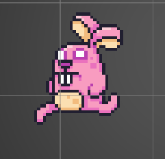
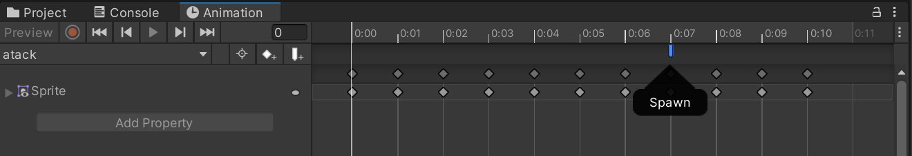
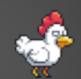

# ***User Manual for Enemy Behavior Framework for 2D Video Games***

[🇪🇸 Leer en Español](./Manual/Manual_es.md)  
***Welcome to the user manual.***  
**Creators:** Cristina Mora Velasco and Francisco Miguel Galván Muñoz  
**Date:** March 2025

## Table of Contents

- [Introduction](#introduction)
- [Objective of the Tool](#objective-of-the-tool)
- [Objective of the Manual](#objective-of-the-manual)
- [Functionality](#functionality)
- [Target Audience](#target-audience)
- [Requirements](#requirements)
- [Installation](#installation)
- [Package Contents](#package-contents)
- [Detailed Components](#detailed-components)
  - [Finite State Machine (FSM)](#finite-state-machine-fsm)
  - [State](#state)
  - [Sensors](#sensors)
  - [Actuators](#actuators)
  - [Animator Manager](#animator-manager)
- [Practical Examples](#practical-examples)
- [Troubleshooting](#troubleshooting)
- [Frequently Asked Questions](#frequently-asked-questions)
- [Glossary](#glossary)
- [Contact and Support](#contact-and-support)

## Introduction

This document provides *detailed instructions* on how to use the 2D enemy behavior framework for video games.  
This manual is divided into several sections covering all necessary aspects for the installation and use of the tool. Initially, the user will be guided through the installation process from a GitHub repository. Next, the [architecture](#arquitectura) of the tool will be detailed, explaining the key components and the concept of [Finite State Machines](#fsm). Subsequently, a step-by-step [workflow](#flujo-de-trabajo) for creating new enemies will be presented, including the configuration of [states](#estado), transitions, sensors, and actuators. Finally, tips and best practices for effective enemy design will be offered, as well as information on how to obtain technical support.

## Objective of the Tool

Over time, games have evolved, becoming increasingly complex. Enemies, which are the player's main obstacle, must remain challenging enough to capture the player's attention without feeling overwhelming. This increases the time and complexity of creation. To facilitate this task, the **Enemy Behaviour Framework 2D** aims to create fully functional enemies starting from simple elements called actuators and controlled by a finite state machine. Additionally, to obtain information from the outside world, Sensors will be needed, which will function as transitions between different states.

## Objective of the Manual

This manual aims to provide a clear and detailed guide so that users can install, configure, and use the tool more easily.
*The tool has been designed to simplify and improve the process of creating functional 2D enemies within the Unity environment*. Utilizing a Finite State Machine (FSM) based architecture, it allows designers to define enemy behavior visually and intuitively, through the addition of custom states and transitions.

## Functionality

- Creation and management of enemy behaviors in 2D.
- Implementation of state machines to define enemy AI.

## Target Audience

Both the tool and the manual have been *created for designers or individuals without advanced programming knowledge*.
While *basic knowledge of Unity* and fundamental game development concepts is recommended, this manual has been prepared with the intention of being comprehensive enough for users with different levels of experience to use the tool effectively.

## Requirements

Before starting, make sure you meet the following requirements:

- Have a version of Unity equal to or greater than *2022.3.18 (LTS)*.

## Installation

Step-by-step installation:

1. Download the Tool from GitHub:
   - The tool is distributed as a Unity package via a GitHub URL. To obtain the tool, go to [Link](https://github.com/CiscoGalvan/TFG/blob/main/Package/FrameworkEnemies2D.unitypackage).
   - Once in the repository, press *Control + Shift + S* keys or click on *More File Actions* (three-dot button) and select *Download*.
2. Open Unity and load your project or create a new 2D project.
3. In Unity, go to *Assets > Import Package > Custom Package*.
4. Select the downloaded file (*.unitypackage*).
5. Press *Import* and make sure to check all the necessary options.
6. Once imported, verify that the tool's assets appear in the Unity *Project* window.

## Package Contents

### *Scripts*

- Contains the necessary [scripts](#script) for the [framework](#framework) to function.
- Includes logic for state management, enemy behaviors, and collision detection.
- Organized into subfolders according to their functionality (*FSM*, *Actuators*, *SensorsAndEmitters*, *Editors*, *PlayerBehaviour*, *Basic Components*, *Editors*, *Animation*).

### *Scenes*

- Contains example scenes with functional enemies.
- Each scene shows different configurations.

### *Prefabs*

- Includes pre-configured enemy [prefabs](#prefab) ready for use.

### *Animations*

- Contains enemy animation clips.
- Includes animations such as *Idle*, *Walk*, *Attack*, and *Death*.
- Example controller to manage animations.
- Compatible with Unity's *Animator* system.

## Detailed Components

### Actuators

Actuators are components that allow enemies to perform actions. These actions define the movement or creation of other enemies.
We have 7 types of actuators:

- **Spawner Actuator**:
  
  Allows generating (spawning) new enemies.
  - *Infinite Enemies:* if you want to create infinite enemies, otherwise you must specify the number of times you want to spawn the list.
  - *Spawn Interval:* how often enemies are created.
  - *Prefab to Spawn:* object you want to create.
  - *Spawn Point:* position where you want the object to be created.

  Being a list, you can spawn more than one object at a time.

- **Horizontal Actuator**:
  
This actuator allows moving an object horizontally, either to the left or to the right, with different speed and behavior configurations after a collision. It has different configurations.

  - *Reaction After Collision*
  Defines what happens when the object collides with another:
    - *None:* No reaction upon collision.
    - *Bounce:* The object changes direction and continues moving in the opposite direction.
    - *Destroy:* The object disappears upon collision.
  - *Direction*
  Determines where the object moves:
    - *Left:* The object will move to the left.
    - *Right:* The object will move to the right.
  - *Is Accelerated*
    - *False:* If not accelerated, the enemy will move with a constant linear speed. You can configure:
      - *Throw:* The force will be applied only once, simulating a launch.
      - *Speed:* Sets the speed at which the object will move.
    - *True:* If the movement is accelerated, the speed will increase:
      - *Goal Speed:* This is the maximum speed the object will reach after accelerating.
      - *Interpolation Time:* This is the time it takes for the object to go from actual speed to it's target speed.
      - *Easing Function:* Defines how the acceleration behaves.

- **Vertical Actuator**:  
   
 This actuator allows moving an object vertically, either up or down, with different speed and behavior configurations after a collision.

  - *Reaction After Collision*
  Defines what happens when the object collides with another:
    - *None:* No reaction upon collision.
    - *Bounce:* The object changes direction and continues moving in the opposite direction.
    - *Destroy:* The object disappears upon collision.
  - *Direction*
  Determines where the object moves:
    - *Up:* The object will move upwards.
    - *Down:* The object will move downwards.
  - *Is Accelerated*
    - *False:* If not accelerated, the enemy will move with a constant linear speed. You can configure:
      - *Throw:* The force will be applied only once, simulating a launch.
      - *Speed:* Sets the speed at which the object will move.
    - *True:* If the movement is accelerated, the speed will increase:
      - *Goal Speed:* This is the maximum speed the object will reach after accelerating.
      - *Interpolation Time:* This is the time it takes for the object to go from actual speed to it's target speed.
      - *Easing Function:* Defines how the acceleration behaves.

- **Directional Actuator**:
  
  Makes the enemy move in a specific direction described by an angle.
  - *Reaction After Collision*
  Defines what happens when the object collides with another:
    - *None:* No reaction upon collision.
    - *Bounce:* The object changes direction and simulates a bounce.
    - *Destroy:* The object disappears upon collision.
  - *Angle:* Angle at which the object will move.
  - *Aim Player:* Indicates whether the object will follow the player's direction (with this option, the angle does not appear because its value is determined by your position and the target's position). 
  For this to happen there must be an object with [tag](#tag) "Player".
  - *Is Accelerated*
    - *False:* If not accelerated, the enemy will move with a constant linear speed. You can configure:
      - *Throw:* The force will be applied only once, simulating a launch.
      - *Speed:* Sets the speed at which the object will move.

    - *True:* If the movement is accelerated, the speed will increase:
      - *Goal Speed:* This is the maximum speed the object will reach after accelerating.
      - *Interpolation Time:* This is the time it takes for the object to go from actual speed to its target speed.
      - *Easing Function:* Defines how the acceleration behaves.

- **Circular Actuator**:  
  
 Permits circular movements around a specific rotation point.
  - *Rotation Point Position*
    Defines the central point around which the rotation occurs.
    - *None:* If not assigned, the object will rotate around its own center.
    - *[Transform](#transform):* If an object is assigned, the rotation will occur around that point.

  - *Max Angle*
    Maximum angle that the circular movement can reach (360 indicates a full circle, other angles behave like a pendulum).

  - *Can Rotate*
    Determines if the object can rotate on its own axis in addition to moving in a circle.
    - *False:* The object will only move in the circular path without rotating on itself.
    - *True:* The object will rotate on its own axis while moving.

  - *Is Accelerated*
    - *False:* If not accelerated, the object will move at a constant speed defined by the *Speed* parameter.
    - *True:* If accelerated, the speed will increase progressively according to the following parameters:
      - *Goal Speed:* This is the maximum speed the object will reach.
      - *Interpolation Time:* This is the time it takes for the object to go from speed 0 to its target speed.
      - *Easing Function:* Defines how the acceleration behaves.

- **Move to a Point Actuator**:
Makes the enemy move towards a specific fixed point in the scene. There are two configurations depending on *Use Way*:
  - *Random Area*: Picks random points within an area.

    - *Random Area:* [Collider](#collider) that will serve as the area reference.
    - *Time Between Random Points:* How often the point changes to a different one.
  - *Waypoint*: Indicates that we want to follow a predetermined path of points.
    - *Is A Cycle:* Indicates whether we want the list to restart when reaching the end of the waypoints.
    - *Same Waypoints Behaviour:* Indicates whether we want the behavior to be the same for all waypoints.
      - If so, a single point specification panel will be created:

        - *Time Between Waypoints:* Time taken between one point and another.
        - *Are Accelerated:* Whether the movement is accelerated or not. If so, an easing function will appear indicating the acceleration.
        - *Should Stop:* Indicates whether to stop upon reaching a point. If it should stop, specify the duration.
      - If not, the same data will appear for each waypoint.
    

- **Move to an Object Actuator**:  
  
  Makes the enemy automatically move towards a specific object. If the object moves, the enemy will change its direction to go towards the object.
  - *Waypoint Transform:* Transform of the object to be chased.
  - *Time to Reach:* Time it takes to reach the target.
  - *Is Accelerated:*
    - *False:* If not accelerated, the position will change constantly.
    - *True:* If accelerated, the position will be defined by the easing function.
    
- **Spline Follower Actuator**:

  Makes the enemy automatically move and rotate following a path defined by a spline.
  - *Spline Container:* Transform of the object to be chased.
  - *Speed:* Time it takes to reach the target.
  - *Is Accelerated*
    - *False:* If not accelerated, the object will move at a constant speed defined by the *Speed* parameter.
    - *True:* If accelerated, the speed will increase progressively according to the following parameters:
      - *Goal Speed:* This is the maximum speed the object will reach.
      - *Interpolation Time:* This is the time it takes for the object to go from current speed to it's target speed.
      - *Easing Function:* Defines how the acceleration behaves.

### Sensors

Sensors allow detecting information from the environment and triggering transitions.
We have five sensors:

- **Area Sensor:**  
   
 The area sensor detects when a specific object enters its detection zone. 
  - *Start Detecting Time:* Delay time until detection starts.
  - *Target:* Object to be detected.
  - *Detection Condition:* Indicates whether to detect when leaving or entering the area.

- **Collision Sensor:**  
   
 Detects when the enemy physically collides with another object. Unlike the *Area Sensor*, this requires an actual collision rather than just detecting presence within an area. 
  You must specify which *[physics layers](#capa-fisica)* activate the sensor.
  - *Start Detecting Time:* Delay time until detection starts.
  - *Layers to Collide:* Physics layer mask indicating what we want to collide with.

- **Distance Sensor:**  
  
 Detects when a specific object *Target* is at a *certain distance from the enemy*. 
  - *Distance type:* Type of distance to check.
    - Magnitude: 360 degrees of detection.
    - Single Axis: A single axis.
  - *Detection Condition:* Indicates whether to detect when leaving or entering the area.
  - *Target:* Object to be detected.
  - *Start Detecting Time:* Delay time until detection starts.
  - *Detection Distance:* Detection distance.

- **Time Sensor:**  
   
 Detects when a specific time elapses.
  - *Start Detecting Time:* Delay time until detection starts.
  - *Detection Time:* Detection time.
- **Damage Sensor:**
  
 Detects when an entity *receives damage*.
 This sensor is used to manage the *life* of both enemies and the player.  For damage to be received, *Active From Start* must be set to true.

- **Damage Emitter**:
  It is responsible for *dealing damage*. You need to specify the type of damage, and each type of damage has its own parameters:

  - **Instant:**
  
  Instant damage that affects only once upon contact.
    - *Destroy After Doing Damage:* Allows indicating whether the object should disappear after dealing damage.
    - *Instant Kill:* Allows indicating whether to directly kill the entity it collides with.
    - *Damage Amount:* If you don't want to instantly eliminate the entity it collides with, indicate the damage to be applied.

  - **Permanence:**
  
  Damage over time that affects while you are inside the object.
    - *Damage Amount:* Amount of health subtracted each time.
    - *Damage Cooldown:* Time interval between each damage application.

  - **Residual:**
  
  Residual damage continues to affect even when you are no longer in contact.
    - *Destroy After Doing Damage:* Allows indicating whether the object should be destroyed after the first hit.
    - *Instant Damage Amount:* Initial damage applied upon first contact.
    - *Residual Damage Amount:* Damage applied in each residual repetition.
    - *Damage Cooldown:* Time interval between each residual damage application.
    - *Number Of Applications:* Total number of times residual damage is applied.

### State

A state is a specific behavior that an enemy can have at a certain time. States are responsible for storing actions.
 
 Makes the enemy automatically move and rotate following a path defined by a spline.

- *Actuator List:* Action/actions we are going to perform.
- *Transition List:* To have *Transitions* from one state to another, you must specify the sensor that will be responsible for detecting that change and the state you want to transition to.
- *Damaged Emitters:* If we want damage to be dealt in this state, we must specify which *DamageEmitter* will be active.
- *Debug State:* If we want to *debug* information about the movement to be performed.

### Finite State Machine (FSM)

 
 The FSM organizes an enemy's behavior into **states** (Idle, Patrol, Attack, etc.). This component is responsible for calling and managing all the states of an enemy.

- *Initial State:* the enemy's initial state.

**Example:** A "Guard" can have states like Patrol, Chase, and Attack. If the player enters its field of vision, it transitions from Patrol to Chase. If it reaches the player, it transitions to Attack. If it loses sight of the player, it returns to Patrol.

### Animator Manager

Manages the animations of enemies based on their states and actions. If you want to add an animation, you also need to add a Unity Animator component.
It is important that all [sprites}(#sprite) intended for use *face to the right*.

- *Can [Flip](#flip) X:* Indicates if the sprite can rotate in X axis.
- *Can Flip Y:* Indicates if the sprite can rotate in Y axis.

### Life

Manages the life of objects.
 

- *Initial Life:* Initial health.
- *Entity type:* Type of entity (Player or Enemy).

## Practical Examples

All examples start from the Scene Template: **Base Scene**.  
To create a new scene, open the File menu, select New Scene, and choose Base Scene.
The scene includes a player and a world ready to function.

**WARNING**: In the examples, when it says to delete all animator states, it refers to those that are not native to Unity, i.e., those that appear in gray. Unity's own states will continue to appear even if you try to delete them.

**Artwork Notice**: The graphic material used primarily in this framework has been obtained from the Unity Asset Store and belongs to the creator Pixel Frog, whose itch.io page is: [https://pixelfrog-assets.itch.io/](https://pixelfrog-assets.itch.io/)
The eagle and item effects are from:
<https://assetstore.unity.com/packages/2d/characters/sunny-land-103349>
### First Example: Spikes

One of the most common enemies are spikes, which do not move but do damage to the player. Let's create them.
For the example, I will use the stone image:  

  1. Create an object named *spikes* from the BaseEnemy prefab located in Assets/Prefabs.

  2. Change the *[Sprite Renderer](#sprite-renderer)* to the spikes image (if it doesn’t already match), which is located in Assets/Animations/Sprites/Spikes, and adjust the Collider to fit the image.

  3. Freeze the X and Y positions under the Constraints section of the Rigidbody 2D, so that the spikes remain fixed in place.

  4. Remove the AnimatorManager and Animator components, since the object doesn't require animation.

  5. Configure the Damage Emitter as follows:
      - Active From Start: True
      - Damage Type: Permanence
      - Destroy After Doing Damage: False
      - Damage Amount: 1
      - Damage Cooldown: 2

### Second Example: Wanderer

Another very common enemy is a wanderer, also known as: Goomba, Reptacillo, or by another name in many games.
For the example, I will use the rabbit image:  

  1. Create an object named deambulador from the BaseEnemy prefab, located in Assets/Prefabs.

  2. Change the Sprite Renderer to any Bunny image found in Assets/Animations/Sprites/Bunny, and adjust the Collider to match the image.

  3. Freeze the rotation under Constraints of the Rigidbody 2D.

  4. Configure the Damage Emitter as follows:
      - Active From Start: True
     - Damage Type: Instant
      - Destroy After Doing Damage: False
     - Instant Kill: False
      - Damage Amount: 1

  5. Add a Horizontal Actuator movement component and add it to the Actuator List of the State.

  6. Configure the Horizontal Actuator:
      - Reaction After Collision: Bounce
      - Layers to Collide: World, Player
      - Follow Player: False
      - Direction: Left
      - Is Accelerated: False
      - Throw: False
      - Speed: 7
  7. Configure the Animator Manager:
      - Can Flip X: True
      - Can Flip Y: False

  8. Duplicate the *Animator Controller* that comes as an example in Assets/Animations.

  9. Open Unity’s animation editor (by double-clicking the Animator Controller you just created), where you’ll see many states. Since we only want the animations for Horizontal Movement, Damage, and Die, delete all other states (select them with the mouse and press Delete).

  10. Click on the Horizontal Movement state and drag the animation you want to use into Motion — in this case, use Run from Assets/Animations/Sprites/Bunny.

  11. Click on the Damage state and drag the animation you want to use into Motion — in this case, use Hit from Assets/Animations/Sprites/Bunny.

  12. Click on the Die state and drag the animation you want to use into Motion — again, use Hit from Assets/Animations/Sprites/Bunny.

  13. Assign the duplicated Animator Controller to the Animator component of the deambulador enemy.

### Third Example: Turret + Bullets

Let's continue creating an enemy that shoots bullets. To do this, we will first create the bullets and then the enemy.
For the bullet example, I will use the bullet image:  

  1. Create a prefab named Bullet from the BaseEnemy prefab, located in Assets/Prefabs.
  2. Change the Sprite Renderer to the bullet sprite found in Assets/Animations/Sprites/Trunk, and adjust the Collider to match the image.
  3. Freeze the rotation in the Constraints section of the Rigidbody 2D.
  4. Configure the Damage Emitter as follows:
      - Active From Start: True
      - Damage Type: Instant
      - Destroy After Doing Damage: True
      - Instant Kill: False
      - Damage Amount: 1
  5. Add a Horizontal Movement component and add it to the Actuator List of the State.
  6. Configure the Horizontal Movement:
      - Reaction After Collision: Destroy
      - Layers to Collide: World, Player
      - Follow Player: False
      - Direction: Left
      - Is Accelerated: False
      - Throw: False
      - Speed: 10
  7. Remove the AnimatorManager and Animator components, as they are not needed (the object has no animation).

Now let's create the Turret:
For the turret example, I will use the plant image:  
  

  1. Create an object named Torret from the BaseEnemy prefab located in Assets/Prefabs.
  2. Change the Sprite Renderer to the trunk image located in Assets/Animations/Sprites/Trunk and adjust the Collider to fit the image.
  3. Freeze the rotation and the X and Y positions in the Rigidbody 2D Constraints so that the turret remains fixed.
  4. Remove the Damage Emitter component and delete it from the Damage Emitter List in the State.
  5. Add a Spawner Actuator component and include it in the Actuator List of the State.
  6. Configure the Spawner Actuator as follows:
      - Infinite Enemies: True
      - Spawn Interval: 1
      - Spawn List: One element
        - Prefab To Spawn: Add the previously created bullet prefab.
        - Spawn Point: Create an empty GameObject and assign it as the reference.
  7. Position the empty GameObject at the mouth of the trunk, as the bullets will be spawned from there.
  8. It is important to remember that bullets are configured to move to the left, so the trunk should be placed on the right side of the scene.
  
Now let’s configure the animations:

  9. Configure the Animator Manager:
        - Can Flip X: False
        - Can Flip Y: False
  10. Duplicate the *Animator Controller* that is provided as an example in Assets/Animations.
  11. Open the animation editor in Unity by double-clicking on the Animator Controller you just created. You'll see many possible states — since we only want it to play Idle and Spawn animations, delete the rest by selecting them and pressing Delete.
  12. Click on the Idle state and drag the animation you want into the Motion field; in this case, use the Idle animation from Assets/Animations/Sprites/Trunk.
  13. Click on the Spawn state and drag the desired animation into the Motion field; in this case, use the Atack animation from Assets/Animations/Sprites/Trunk.
  14. Make sure the Atack animation clip has an event at second 0:07 that calls the Spawn method. This will ensure that the bullet is created at the correct moment during the animation.
   
  15. Assign the duplicated Animator Controller to the Animator component of the turret enemy.

### Fourth Example: TikTik 

Let's create an enemy from HollowKnight, the [TikTik](https://hollowknight.fandom.com/es/wiki/Tiktik), which moves along a platform, following its edge.
For this example, we will use the chicken image:

  

Before we start creating the enemy, let's add a 2D square object that will serve as the platform. We need to add a Box Collider 2D component to it and set its layer to World. If you want it to match the color of the map edges, apply the material named *Brown* found in Assets/Materials.

Let's start with the enemy:

  1. Create an object called Chicken by duplicating the BaseEnemy prefab located in Assets/Prefabs.
  2. Change the *Sprite Renderer* to the chicken sprite located in Assets/Animations/Sprites/Chicken and adjust the Collider to match the image.
  3. Configure the Damage Emitter:
      - Active From Start: True
      - Damage Type: Instant
      - Destroy After Doing Damage: True
      - Instant Kill: False
      - Damage Amount: 1
  4. Add a Spline Follower Actuator component and add it to the Actuator List of the State.
  5. Create a Spline with a square shape and rotate it 90 degrees on the X-axis.
  6. Flip the Spline to negative scale on the X-axis.
  7. Configure the Spline Follower Actuator:
      - Spline Container: Add the newly created spline as a reference
      - Teleport to Closest Point: Enemy
      - Is Accelerated: False
      - Speed: 1

  Now, let's adjust the animations:

  8. Configure the Animator Manager:
      - Can Flip X: False
      - Can Flip Y: False
  9. Duplicate the Animator Controller that was created as an example in Assets/Animations.
  10. Open the Animation editor in Unity (by double-clicking the Animator Controller we just created). You’ll see many possible states. Since we only want the animations for Idle, Damage, and Die, delete the others (select them with the mouse and press delete).
  11. Click on the Idle state and drag the animation you want to use into the Motion field; in this case, use Run from Assets/Animations/Sprites/Chicken.
  12. Click on the Damage state and drag the animation you want to use into the Motion field; in this case, use Hit from Assets/Animations/Sprites/Chicken.
  13. Add the duplicated controller to the Animator of the Chicken enemy.

### Fifth Example: Stalactites

Finally, let's create a common enemy: stalactites.
For the example, we will use the bird image:  

  1. Create an object called FatBird based on the BaseEnemy prefab located in Assets/Prefabs.
  2. Change the Sprite Renderer to the bird sprite found in Assets/Animations/Sprites/FatBird and adjust the Collider to match the image.
  3. Configure the Damage Emitter:
      - Active From Start: True
      - Damage Type: Instant
      - Destroy After Doing Damage: True
      - Instant Kill: True
  4. Freeze rotation in the Constraints section of the Rigidbody 2D component.
  5. Add a new element to the Transition List in the State component (included by default in the BaseEnemy).
  6. Create a new State component and assign it as the Target State for the element created in step 5.
  7. For the sensor that will trigger the transition, create an empty 2D square object that includes:
      - Box Collider 2D: Adjust it to the area where you want to detect the player’s entry.
      - Area Sensor, configured as follows:
        - Start Detecting Time: 0
        - Target: Player (reference to the player)
        - Detection Condition: Inside Magnitude (we want it to detect when the player enters the area)
  8. Assign the Area Sensor you just configured to the Sensor field of the Transition List item created in step 5.
  9. In the second State (the one without a transition, which you created), add an element to the Actuator List.
  10. Create a Vertical Actuator and assign it:
  11. Configure the Vertical Actuator:
      - Reaction After Collision: Destroy
      - Layers to Collide: World, Player
      - Follow Player: False
      - Direction: Down
      - Is Accelerated: False
      - Throw: False
      - Speed: 10
  12. Add the already existing DamageEmitter component to the DamageEmitter list of the second State.

Now let’s adjust the animations:

  13. Configure the Animator Manager:
      - Can Flip X: False
      - Can Flip Y: False
  14. Duplicate the Animator Controller provided as an example in Assets/Animations.
  15. Open the animation editor in Unity (by double-clicking the controller you just created). You’ll see many possible states — since we only need Idle, Vertical Movement, Damage, and Die, delete the rest (select with the mouse and press delete).
  16. Inside Vertical Movement, we only want Down, so delete Up.
  17. Click on the Idle state and drag the desired animation into the Motion field — use IdleFatBird found in Assets/Animations/Sprites/FatBird.
  18. Click on the Die state and drag in the animation — use GroundFatBird from Assets/Animations/Sprites/FatBird.
  19. Double-click on the Vertical Movement state, and in the Down sub-state drag in the FallFatBird animation found in Assets/Animations/Sprites.
  20. Add the duplicated controller to the Animator component of the FatBird enemy.

## Troubleshooting

| Problem                         | Solution                                          |
|---------------------------------|---------------------------------------------------|
| The package starts with errors in the console | Verify the installation and project dependencies. |
|                                 |                                                   |
|                                 |                                                   |

## Frequently Asked Questions

Section to answer common questions about the use of the software. TO BE FILLED IN WHEN WE DO USER TESTS

## Glossary

List of technical terms and their definitions to facilitate understanding of the manual:

- ***Architecture:*** In this case, the architecture of a tool refers to how it is structured, what elements it uses, or how it is organized.

- ***Workflow:*** It is the order or steps that must be completed in a task.

- ***Finite State Machines (FSM):*** A Finite State Machine is a computational model used to design algorithms that describe the behavior of a system through a limited number of possible states and the transitions between those states. In the context of artificial intelligence in video games, each state represents a specific behavior. Transitions between these states are triggered by specific conditions, often generated by the enemy’s interaction with its environment.

- ***State:*** In a state machine, a state represents a situation in which an enemy may find itself at a given moment. It defines the enemy’s actions while it remains in that state. For example, an enemy can be in Idle, Patrol, Attack, etc.

- ***Transform:*** It is a Unity component that stores and manages the position, rotation, and scale of an object in the scene. It is essential for manipulating any object within the game world, as it allows it to be moved, rotated, and scaled.

- ***Flip:*** To flip the image.

- ***Script:*** Code file that contains instructions to control the behavior of objects within Unity.

- ***Framework:*** A structured set of tools, libraries, and rules that facilitate the development of games or applications.

- ***Prefab:*** Reusable template of a Unity object.

- ***Tag:*** Identifier label assigned to an object to classify or recognize it easily in code.

- ***Collider:*** Component that defines the invisible physical shape of an object in Unity.

- ***Physics Layer:*** A physics layer in Unity is a label assignable to a GameObject that allows control over which other objects it can interact with.

- ***Sprite:*** A sprite is a type of 2D image used to represent characters, objects, backgrounds, or other visual elements.

- ***Sprite Renderer:*** The Sprite Renderer in Unity is a component used to draw (render) a sprite on an object, controlling its visual appearance, such as the image it displays, its color, materials...

## Contact and Support

It is recommended to review example scenes and additional documentation from the developers.
For additional technical support or to provide feedback on the tool, you can contact the developers directly through the following means:
  - [crmora03@ucm.es](mailto:crmora03@ucm.es).
  - [fragalva@ucm.es](mailto:fragalva@ucm.es).
---
© 2025 Cristina Mora Velasco and Francisco Miguel Galván Muñoz. All rights reserved.
