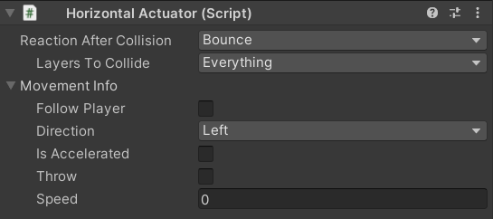

# ***User Manual for Enemy Behavior Framework for 2D Video Games***

[🇪🇸 Leer en Español](./Manual/Manual_es.md)  
***Welcome to the user manual.***  
**Creators:** Cristina Mora Velasco and Francisco Miguel Galván Muñoz  
**Date:** March 2025

## Table of Contents

- [Introduction](#introduction)
- [Objective of the Tool](#objective-of-the-tool)
- [Objective of the Manual](#objective-of-the-manual)
- [Functionality](#functionality)
- [Target Audience](#target-audience)
- [Requirements](#requirements)
- [Installation](#installation)
- [Package Contents](#package-contents)
- [Detailed Components](#detailed-components)
  - [Finite State Machine (FSM)](#finite-state-machine-fsm)
  - [State](#state)
  - [Sensors](#sensors)
  - [Actuators](#actuators)
  - [Animator Manager](#animator-manager)
- [Practical Examples](#practical-examples)
- [Troubleshooting](#troubleshooting)
- [Frequently Asked Questions](#frequently-asked-questions)
- [Glossary](#glossary)
- [Contact and Support](#contact-and-support)

## Introduction

This document provides *detailed instructions on how to use the enemy behavior tool for 2D video games*.  
This manual is divided into several sections covering all necessary aspects for the installation and use of the tool. Initially, the user will be guided through the installation process from a GitHub repository. Next, the architecture of the tool will be detailed, explaining the key components and the concept of Finite State Machines. Subsequently, a step-by-step workflow for creating new enemies will be presented, including the configuration of states, transitions, sensors, and actuators. Finally, tips and best practices for effective enemy design will be offered, as well as information on how to obtain technical support.

## Objective of the Tool

Over time, games have evolved, becoming increasingly complex. Enemies, which are the player's main obstacle, must remain challenging enough to capture the player's attention without feeling overwhelming. This increases the time and complexity of creation. To facilitate this task, the **Enemy framework 2D** aims to create fully functional enemies starting from simple elements called actuators and controlled by a state machine. Additionally, to obtain information from the outside world, Sensors will be needed, which will function as transitions between different states.

## Objective of the Manual

This manual aims to provide a clear and detailed guide so that users can install, configure, and use the tool more easily.
*The tool has been designed to simplify and improve the process of creating functional 2D enemies within the Unity environment*. Utilizing a Finite State Machine (FSM) based architecture, it allows designers to define enemy behavior visually and intuitively, through the addition of custom states and transitions.

## Functionality

- Creation and management of enemy behaviors in 2D.
- Implementation of state machines to define enemy AI.

## Target Audience

Both the tool and the manual have been *created for designers or individuals without advanced programming knowledge*.
While *basic knowledge of Unity* and fundamental game development concepts is recommended, this manual has been prepared with the intention of being comprehensive enough for users with different levels of experience to use the tool effectively.

## Requirements

Before starting, make sure you meet the following requirements:

- Have a version of Unity equal to or greater than *2022.3.18 (LTS)*.

## Installation

Step-by-step installation:

1. Download the Tool from GitHub:
   - The tool is distributed as a Unity package via a GitHub URL. To obtain the tool, go to [Link](https://github.com/CiscoGalvan/TFG/blob/main/Package/FrameworkEnemies2D.unitypackage).
   - Once in the repository, press *Control + Shift + S* keys or click on *More File Actions* (three-dot button) and select *Download*.
2. Open Unity and load your project or create a new 2D project.
3. In Unity, go to *Assets > Import Package > Custom Package*.
4. Select the downloaded file (*.unitypackage*).
5. Press *Import* and make sure to check all the necessary options.
6. Once imported, verify that the tool's assets appear in the Unity *Project* window.

## Package Contents

### *Scripts*

- Contains the necessary scripts for the framework to function.
- Includes logic for state management, enemy behaviors, and collision detection.
- Organized into subfolders according to their functionality (*FSM*, *Actuators*, *SensorsAndEmitters*, *Editors*, *PlayerBehaviour*, *Basic Components*, *Editors*, *Animation*).

### *Scenes*

- Contains example scenes with functional enemies.
- Each scene shows different configurations.

### *Prefabs*

- Includes pre-configured enemy prefabs ready for use.

### *Animations*

- Contains enemy animation clips.
- Includes animations such as *Idle*, *Walk*, *Attack*, and *Death*.
- Example controller to manage animations.
- Compatible with Unity's *Animator* system.

## Detailed Components

### Actuators

Actuators are components that allow enemies to perform actions. These actions define the movement or creation of other enemies.
We have 7 types of actuators:

- **Spawner Actuator**:
  
  Allows generating (spawning) new enemies.
  - *Infinite Enemies:* if you want to create infinite enemies, otherwise you must specify the number of times you want to spawn the list.
  - *Spawn Interval:* how often enemies are created.
  - *Prefab to Spawn:* object you want to create.
  - *Spawn Point:* position where you want the object to be created.

  Being a list, you can spawn more than one object at a time.

- **Horizontal Actuator**:
  
This actuator allows moving an object horizontally, either to the left or to the right, with different speed and behavior configurations after a collision. It has different configurations.

  - *Reaction After Collision*
  Defines what happens when the object collides with another:
    - *None:* No reaction upon collision.
    - *Bounce:* The object changes direction and continues moving in the opposite direction.
    - *Destroy:* The object disappears upon collision.
  - *Direction*
  Determines where the object moves:
    - *Left:* The object will move to the left.
    - *Right:* The object will move to the right.
  - *Is Accelerated*
    - *False:* If not accelerated, the enemy will move with a constant linear speed. You can configure:
      - *Throw:* The force will be applied only once, simulating a launch.
      - *Speed:* Sets the speed at which the object will move.
    - *True:* If the movement is accelerated, the speed will increase:
      - *Goal Speed:* This is the maximum speed the object will reach after accelerating.
      - *Interpolation Time:* This is the time it takes for the object to go from speed 0 to its target speed.
      - *Easing Function:* Defines how the acceleration behaves.

- **Vertical Actuator**:  
   
 This actuator allows moving an object vertically, either up or down, with different speed and behavior configurations after a collision.

  - *Reaction After Collision*
  Defines what happens when the object collides with another:
    - *None:* No reaction upon collision.
    - *Bounce:* The object changes direction and continues moving in the opposite direction.
    - *Destroy:* The object disappears upon collision.
  - *Direction*
  Determines where the object moves:
    - *Up:* The object will move upwards.
    - *Down:* The object will move downwards.
  - *Is Accelerated*
    - *False:* If not accelerated, the enemy will move with a constant linear speed. You can configure:
      - *Throw:* The force will be applied only once, simulating a launch.
      - *Speed:* Sets the speed at which the object will move.
    - *True:* If the movement is accelerated, the speed will increase:
      - *Goal Speed:* This is the maximum speed the object will reach after accelerating.
      - *Interpolation Time:* This is the time it takes for the object to go from speed 0 to its target speed.
      - *Easing Function:* Defines how the acceleration behaves.

- **Directional Actuator**:
  
  Makes the enemy move in a specific direction described by an angle.
  - *Reaction After Collision*
  Defines what happens when the object collides with another:
    - *None:* No reaction upon collision.
    - *Bounce:* The object changes direction and simulates a bounce.
    - *Destroy:* The object disappears upon collision.
  - *Angle:* Angle at which the object will move.
  - *Aim Player:* Indicates whether the object will follow the player's direction (with this option, the angle does not appear because its value is determined by your position and the target's position).
  - *Is Accelerated*
    - *False:* If not accelerated, the enemy will move with a constant linear speed. You can configure:
      - *Throw:* The force will be applied only once, simulating a launch.
      - *Speed:* Sets the speed at which the object will move.

    - *True:* If the movement is accelerated, the speed will increase:
      - *Goal Speed:* This is the maximum speed the object will reach after accelerating.
      - *Interpolation Time:* This is the time it takes for the object to go from speed 0 to its target speed.
      - *Easing Function:* Defines how the acceleration behaves.

- **Circular Actuator**:  
  
 Permits circular movements around a specific rotation point.
  - *Rotation Point Position*
    Defines the central point around which the rotation occurs.
    - *None:* If not assigned, the object will rotate around its own center.
    - *Transform:* If an object is assigned, the rotation will occur around that point.

  - *Max Angle*
    Maximum angle that the circular movement can reach (360 indicates a full circle, other angles behave like a pendulum).

  - *Can Rotate*
    Determines if the object can rotate on its own axis in addition to moving in a circle.
    - *False:* The object will only move in the circular path without rotating on itself.
    - *True:* The object will rotate on its own axis while moving.

  - *Is Accelerated*
    - *False:* If not accelerated, the object will move at a constant speed defined by the *Speed* parameter.
    - *True:* If accelerated, the speed will increase progressively according to the following parameters:
      - *Goal Speed:* This is the maximum speed the object will reach.
      - *Interpolation Time:* This is the time it takes for the object to go from speed 0 to its target speed.
      - *Easing Function:* Defines how the acceleration behaves.

- **Move to a Point Actuator**:
Makes the enemy move towards a specific fixed point in the scene. There are two configurations depending on *Use Way*:
  - *Random Area*

Random area picks random points within an area.
    - *Random Area:* Collider that will serve as the area reference.
    - *Time Between Random Points:* How often the point changes to a different one.
  - *Waypoint*: Indicates that we want to follow a predetermined path of points.
    - *Is A Circle:* Indicates whether we want the list to restart when reaching the end of the waypoints.
    - *Same Waypoints Behaviour:* Indicates whether we want the behavior to be the same for all waypoints.
      - If so, a single point specification panel will be created:

        - *Time Between Waypoints:* Time taken between one point and another.
        - *Are Accelerated:* Whether the movement is accelerated or not. If so, an easing function will appear indicating the acceleration.
        - *Should Stop:* Indicates whether to stop upon reaching a point. If it should stop, specify the duration.
      - If not, the same data will appear for each waypoint.
    

- **Move to an Object Actuator**:  
  
  Makes the enemy automatically move towards a specific object. If the object moves, the enemy will change its direction to go towards the object.
  - *Waypoint Transform:* Transform of the object to be chased.
  - *Time to Reach:* Time it takes to reach the target.
  - *Is Accelerated:*
    - *False:* If not accelerated, the position will change constantly.
    - *True:* If accelerated, the position will be defined by the easing function.
    
- **Spline Follower Actuator**:

  Makes the enemy automatically move and rotate following a path defined by a spline.
  - *Spline Container:* Transform of the object to be chased.
  - *Speed:* Time it takes to reach the target.
  - *Is Accelerated*
    - *False:* If not accelerated, the object will move at a constant speed defined by the *Speed* parameter.
    - *True:* If accelerated, the speed will increase progressively according to the following parameters:
      - *Goal Speed:* This is the maximum speed the object will reach.
      - *Interpolation Time:* This is the time it takes for the object to go from speed 0 to its target speed.
      - *Easing Function:* Defines how the acceleration behaves.

### Sensors

Sensors allow detecting information from the environment and triggering transitions.
We have five sensors:

- **Area Sensor:**  
   
 The area sensor detects when a specific object enters its detection zone. 
  - *Start Detecting Time:* delay time until detection starts.
  - *Target:* object to be detected.
  - *Detection Condition:* Indicates whether to detect when leaving or entering the area.

- **Collision Sensor:**  
   
 Detects when the enemy physically collides with another object. Unlike the *Area Sensor*, this requires an actual collision rather than just detecting presence within an area. 
  You must specify which *physics layers* activate the sensor.
  - *Start Detecting Time:* delay time until detection starts.
  - *Layers to Collide:* Physics layer mask indicating what we want to collide with.

- **Distance Sensor:**  
  
 Detects when a specific object (*Target*) is at a *certain distance from the enemy*. 
  - *Distance type:* type of distance to check.
    - Magnitude: 360 degrees of detection.
    - Single Axis: a single axis.
  - *Detection Condition:* Indicates whether to detect when leaving or entering the area.
  - *Target:* object to be detected.
  - *Start Detecting Time:* delay time until detection starts.
  - *Detection Distance:* detection distance.

- **Time Sensor:**  
   
 Detects when a specific time elapses.
  - *Start Detecting Time:* delay time until detection starts.
  - *Detection Time:* detection time.
- **Damage Sensor:**
  
 Detects when an entity *receives damage*.
 This sensor is used to manage the *life* of both enemies and the player.  For damage to be received, *Active From Start* must be set to true.

- **Damage Emitter**:
  It is responsible for *dealing damage*. You need to specify the type of damage, and each type of damage has its own parameters:

  - **Instant:**
  
  Instant damage that affects only once upon contact.
    - *Destroy After Doing Damage:* allows indicating whether the object should disappear after dealing damage.
    - *Instant Kill:* allows indicating whether to directly kill the entity it collides with.
    - *Damage Amount:* if you don't want to eliminate or kill, indicate the damage to be applied.

  - **Permanence:**
  
  Damage over time that affects while you are inside the object.
    - *Damage Amount:* amount of health subtracted each time.
    - *Damage Cooldown:* time interval between each damage application.

  - **Residual:**
  
  Residual damage continues to affect even when you are no longer in contact.
    - *Destroy After Doing Damage:* allows indicating whether the object should be destroyed after the first hit.
    - *Instant Damage Amount:* initial damage applied upon first contact.
    - *Residual Damage Amount:* damage applied in each residual repetition.
    - *Damage Cooldown:* time interval between each residual damage application.
    - *Number Of Applications:* total number of times residual damage is applied.

### State

A state is a specific behavior that an enemy can have at a certain time. States are responsible for storing actions.
 
 Makes the enemy automatically move and rotate following a path defined by a spline.

- *Actuator List:* Action/actions we are going to perform.
- *Transition List:* To have *Transitions* from one state to another, you must specify the sensor that will be responsible for detecting that change and the state you want to transition to.
- *Damaged Emitters:* If we want damage to be dealt in this state, we must specify which *DamageEmitter* will be active.
- *Debug State:* If we want to *debug* information about the movement to be performed.

### Finite State Machine (FSM)

 
 The FSM organizes an enemy's behavior into **states** (Idle, Patrol, Attack, etc.). This component is responsible for calling and managing all the states of an enemy.

- *Initial State:* the enemy's initial state.

**Example:** A "Guard" can have states like Patrol, Chase, and Attack. If the player enters its field of vision, it transitions from Patrol to Chase. If it reaches the player, it transitions to Attack. If it loses sight of the player, it returns to Patrol.

### Animator Manager

Manages the animations of enemies based on their states and actions. If you want to add an animation, you also need to add a Unity Animator component.
It is important that all Sprites intended for use *face to the right*.

### Life

Manages the life of objects.
 

- *Initial Life:* initial health.
- *Entity type:* type of entity (player or enemy).

## Practical Examples

ALL examples start from the Scene Template: Base Scene.  
To create a new scene, open the File menu, select New Scene, and choose Base Scene.
The scene includes a player and a world ready to function.

WARNING: In the examples, when it says to delete all animator states, it refers to those that are not native to Unity, i.e., those that appear in gray. Unity's own states will continue to appear even if you try to delete them.

### First Example: SPIKES

One of the most common enemies are spikes, which do not move but do damage to the player. Let's create them.
For the example, I will use the stone image:  

1. Create an object starting from the stone sprite located in Assets/Animations/Sprites.
2. Add a physics layer for the enemy (if not already created), for example, Enemy.
3. Add a Box Collider 2D component.
4. Add a Damage Emitter component.
5. Indicate how you want the enemy to deal damage:
      - We want it to deal damage from the start.
      - That it is of the Persistent type.
      - That it deals 1 damage every 2 seconds.

With that, we will already have an enemy that will damage us upon contact.

6. Add an AnimationManager component. You will see that when you do this, a Unity Animator component is also created.

7. Configure the Animator Manager:
      - We don't want it to flip in either the x or y axis.

8. Duplicate the animation controller that comes as an example in Assets/Animations.

9. Enter the Unity Animator Editor (by double-clicking on the controller you just created), where you will see many possible states. Since we only want the Idle animation, delete the rest of the states (select with the mouse and press Delete).

10. Click on the Idle state and drag the animation you want to use to Motion. In this case, we will use IdleRock, which is located in Assets/Animations/Anim.

11. Add the controller you duplicated to the Animator that was created when you added the AnimatorManager.

Now we would have a functional enemy with animation.

### Second Example: WANDERER

Another very common enemy is a wanderer, also known as: goomba, little reptile, or by another name in many games.
For the example, I will use the bear image:  

1. Create an object starting from the bear sprite located in Assets/Animations/Sprites.
2. Add a physics layer for the enemy (if not already created), for example, Enemy.
3. Add a Box Collider 2D and a Rigidbody 2D component (freeze rotation in constraints).
4. Add a Damage Emitter component.
5. Indicate how you want the enemy to deal damage:
      - We want it to deal damage from the start.
      - That it is of the Instant type.
      - That it deals 1 damage.
6. We are going to add movement, which is controlled by a state machine, so add an FSM component.
7. Add a State component and assign it to the FSM in the Initial State.
8. Add the Horizontal Actuator movement component and add it to the list of actuators in the state.
9. Configure the horizontal movement:
      - We don't want it to be accelerated.
      - That upon collision, it bounces off the World and Player physics layers.
      - That it does not follow the player.
      - That the direction is to the right.
      - That it is not a throw.
      - That it has a continuous speed of 7.
10. Add the already created DamageEmitter component to the list of DamageEmitters of the current State.

Now let's add animations:

10. Add an AnimationManager component. You will see that when you do this, a Unity Animator component is also created.

11. Configure the Animator Manager:
      - We don't want it to flip on the y-axis but we do want it to flip on the x-axis.

12. Duplicate the animation controller that comes as an example in Assets/Animations.

13. Enter the Unity Animator Editor (by double-clicking on the controller you just created), where you will see many possible states. Since we only want the Idle and horizontal movement animations, delete the rest of the states (select with the mouse and press Delete).

14. Click on the Idle state and drag the animation you want to use to Motion. In this case, we will use Idlebear, which is located in Assets/Animations/Anim.

15. Click on the Horizontalovement state and drag the animation you want to use to Motion. In this case, we will use walkbear, which is located in Assets/Animations/Anim.

16. Add the controller you duplicated to the Animator that was created when you added the AnimatorManager.

### Third Example: Turret + Bullets

Let's continue creating an enemy that shoots bullets. To do this, we will first create the bullets and then the enemy.
For the bullet example, I will use the bullet image:  

1. Create an object starting from the bullet sprite located in Assets/Animations/Sprites.
2. Add a physics layer for the enemy (if not already created), for example, Enemy.
3. Add a Box Collider 2D and a Rigidbody 2D component.
4. Add a Damage Emitter component.
5. Indicate how you want the enemy to deal damage:
      - We want it to deal damage from the start.
      - That it is of the Instant type.
      - That it destroys itself after dealing damage.
      - That it deals 1 damage.
6. We are going to add movement, which is controlled by a state machine, so add an FSM component.
7. Add a State component and assign it to the FSM in the Initial State.
8. Add the Directional Actuator component and add it to the list of actuators in the State.
9. Configure the horizontal movement:
      - We want it to collide with the World and Player physics layers.
      - That upon collision, it destroys itself.
      - That it is not accelerated.
      - That it follows the player.
      - That it is not a throw.
      - That it has a continuous speed of 10.
10. Add the already created DamageEmitter component to the list of DamageEmitters of the current State.

Now let's create the Turret:
For the turret example, I will use the plant image:  
  

1. Create an object starting from the plant sprite located in Assets/Animations/Sprites.
2. Add a physics layer for the enemy (if not already created), for example, Enemy.
3. Add a Box Collider 2D and a Rigidbody 2D component (freeze rotation and position in constraints).
4. Add a Damage Emitter component.
5. Indicate how you want the enemy to deal damage:
      - We want it to deal damage from the start.
      - That it is of the Instant type.
      - That it deals 1 damage.
6. We are going to add the creation of other enemies (spawner), which is controlled by a state machine, so add an FSM component.
7. Add a State component and assign it to the FSM in the Initial State.
8. Add the Spawner Actuator component and add it to the list of actuators in the state.
9. Configure the Spawner Actuator:
      - We want it to create infinite enemies.
      - That it does so every 2 seconds.
      - That it creates a single enemy at a time.
10. Add the bullet prefab to the spawner's spawn list, in Prefab to Spawn.
11. Create a new empty object where you want the new enemy to be created and assign it to the spawner's spawn list, in Spawn Point.

Now let's add animations:

12. Add an AnimationManager component. You will see that when you do this, a Unity Animator component is also created.

13. Configure the Animator Manager:
      - We don't want it to flip on either the y-axis or the x-axis.

14. Duplicate the animation controller that comes as an example in Assets/Animations.

15. Enter the Unity Animator Editor (by double-clicking on the controller you just created), where you will see many possible states. Since we only want the Idle and spawn animations, delete the rest of the states (select with the mouse and press Delete).

16. Click on the Idle state and drag the animation you want to use to Motion. In this case, we will use Idleplant, which is located in Assets/Animations/Anim.

17. Click on the Spawn state and drag the animation you want to use to Motion. In this case, we will use SpawnPlant, which is located in Assets/Animations/Anim.

18. Add the controller you duplicated to the Animator that was created when you added the AnimatorManager.

### Fourth Example: TikTik (splines)

Let's create a Hollow Knight enemy, the TikTik, which moves along the edge of a platform.
For the example, I will use the opossum image:  
  
Before starting with the enemy creation, we will add a square 2D object that will serve as a platform. We must add a Box Collider 2D and a Rigidbody 2D component (freeze rotation and position in constraints), as well as add it to the World layer.

Let's start with the enemy:

1. Create an object starting from the opossum sprite located in Assets/Animations/Sprites.
2. Add a physics layer for the enemy (if not already created), for example, Enemy.
3. Add a Box Collider 2D and a Rigidbody 2D component.
4. Add a Damage Emitter component.
5. Indicate how you want the enemy to deal damage:
      - We want it to deal damage from the start.
      - That it is of the Instant type.
      - That it deals 1 damage.
6. We are going to add movement, which is controlled by a state machine, so add an FSM component.
7. Add a State component and assign it to the FSM in the Initial State.
8. Add the Spline Follower Actuator component and add it to the list of actuators in the state.
9. Create a square-shaped Spline and rotate it 90 degrees on the X-axis.
10. Configure the Spline Follower Actuator:
      - Add the newly created spline as a reference.
      - Assign the speed at which we want it to move.
      - We want the enemy to teleport to the curve and not the other way around.
11. Add the already created DamageEmitter component to the list of DamageEmitters of the current State.

Now let's add animations:

10. Add an AnimationManager component. You will see that when you do this, a Unity Animator component is also created.

11. Configure the Animator Manager:
      - We don't want it to flip on either the Y-axis or the X-axis.

12. Duplicate the animation controller that comes as an example in Assets/Animations.

13. Enter the Unity Animator Editor (by double-clicking on the controller you just created), where you will see many possible states. Since we only want the Idle animation, delete the rest (select with the mouse and press Delete).

14. Click on the Idle state and drag the animation you want to use to Motion. In this case, we will use Opossumwolk, which is located in Assets/Animations/Anim.

15. Add the controller you duplicated to the Animator that was created when you added the AnimatorManager.

### Fifth Example: Stalactites

Finally, let's create a common enemy: stalactites.
For the example, I will use the bird image:  

1. Create an object starting from the FatBird sprite located in Assets/Animations/Sprites.
2. Add a physics layer for the enemy (if not already created), for example, Enemy.
3. Add a Box Collider 2D and a Rigidbody 2D component (freeze rotation in constraints).
4. Add a Damage Emitter component.
5. Indicate how you want the enemy to deal damage:
      - We want it to deal damage from the start.
      - That it is of the Instant type.
      - That it directly kills the player.
6. We are going to add actions, which are controlled by a state machine, so add an FSM component.
7. Add a State component and assign it to the FSM in the Initial State.
8. Add an element to the Sensor Transitions list. Fill it by creating and assigning a new state to the transition state.
9. For the sensor that will activate the transition, let's create a 2D object containing:
      - Box Collider 2D
      - Area sensor, with a start time of 0 and the player as the target.
10. For the second state, add a Vertical Actuator type actuator to the Actuator List.
11. Configure the Vertical Actuator:
      - We want it to be deleted upon collision.
      - That it collides with the World and Player physics layers.
      - That it does not follow the player.
      - That it is neither accelerated nor a throw.
      - That it has a speed of 13.
12. Add the already created DamageEmitter component to the list of DamageEmitters of State two.

Now let's add animations:

13. Add an AnimationManager component. You will see that when you do this, a Unity Animator component is also created.

14. Configure the Animator Manager:
      - We don't want it to flip on either the Y-axis or the X-axis.

15. Duplicate the animation controller that comes as an example in Assets/Animations.

16. Enter the Unity Animator Editor (by double-clicking on the controller you just created), where you will see many possible states. Since we only want the Idle, vertical movement, and die animations, delete the rest (select with the mouse and press Delete).

17. Click on the Idle state and drag the animation you want to use to Motion. In this case, we will use IdleFatBird, which is located in Assets/Animations/Sprites.

18. Click on the Die state and drag the animation you want to use to Motion. In this case, we will use GraundFatBird, which is located in Assets/Animations/Sprites.

19. DOUBLE-click on the Vertical Movement state, delete the UP state, and in Down, drag the animation you want to use to Motion. In this case, we will use FallFatBird, which is located in Assets/Animations/Sprites.

15. Add the controller you duplicated to the Animator that was created when you added the AnimatorManager.

## Troubleshooting

| Problem                         | Solution                                          |
|---------------------------------|---------------------------------------------------|
| The package starts with errors in the console | Verify the installation and project dependencies. |
|                                 |                                                   |
|                                 |                                                   |

## Frequently Asked Questions

Section to answer common questions about the use of the software. TO BE FILLED IN WHEN WE DO USER TESTS

## Glossary

List of technical terms and their definitions to facilitate understanding of the manual:

- ***Architecture:*** In this case, the architecture of a tool refers to how it is structured, what elements it uses, or how it is organized.
- ***Workflow:*** It is the order or steps that must be completed in a task.
- ***Finite State Machines (FSM):*** A Finite State Machine is a computational model used to design algorithms that describe the behavior of a system through a limited number of possible states and the transitions between those states. In the context of video game artificial intelligence, each state represents a specific behavior. Transitions between these states are activated by specific conditions, often generated by the enemy's interaction with its environment.

- ***State:*** In a state machine, a state represents a situation in which an enemy can find itself at a given moment. It defines the enemy's actions while it remains in that state. For example, an enemy can be in an *Idle*, *Patrol*, *Attack*, etc.

- ***Serialized:*** Allows modifying values without needing to change the code, by editing them from the Unity editor.
- ***Transform:*** It is a Unity component that stores and manages the position, rotation, and scale of an object in the scene. It is fundamental for manipulating any object within the game world, as it allows moving, rotating, and scaling it.

- ***Flip:*** to mirror the image.

## Contact and Support

It is recommended to review example scenes and additional documentation from the developers.
For additional technical support or to provide feedback on the tool, you can contact the developers directly through the following means: [crmora03@ucm.es](mailto:crmora03@ucm.es).

---
© 2025 Cristina Mora Velasco and Francisco Miguel Galván Muñoz. All rights reserved.
